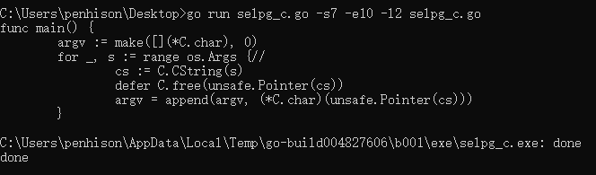
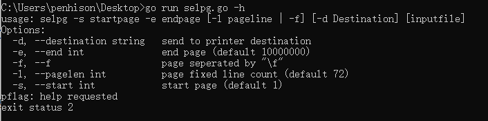
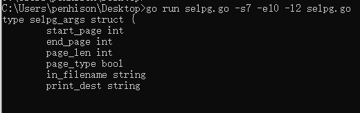
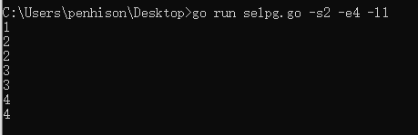

# 作业：开发简单 CLI 程序
作业详细要求见[CLI 命令行实用程序开发基础](https://pmlpml.github.io/ServiceComputingOnCloud/ex-cli-basic)

要求:
使用 golang 开发 [开发 Linux 命令行实用程序](https://www.ibm.com/developerworks/cn/linux/shell/clutil/index.html) 中的 selpg

提示：

1. 请按文档 使用 selpg 章节要求测试你的程序
2. 请使用 pflag 替代 goflag 以满足 Unix 命令行规范， 参考：[Golang之使用Flag和Pflag](https://o-my-chenjian.com/2017/09/20/Using-Flag-And-Pflag-With-Golang/)
3. golang 文件读写、读环境变量，请自己查 os 包
4. “-dXXX” 实现，请自己查 os/exec 库，例如案例 [Command](https://godoc.org/os/exec#example-Command)，管理子进程的标准输入和输出通常使用 io.Pipe，具体案例见 [Pipe](https://godoc.org/io#Pipe)

## 测试环境
Windows 10, go version go1.12.5 windows/amd64

## 版本1
### 思路
作业要求使用go语言开发命令行程序，而题目给了我们现成的c代码，那么为了简单起见，不重复书写代码，我们想办法最大限度地利用已经有的selpg.c开发go程序selpg.go，结合go的语法特性，决定使用cgo，直接使用现有的c代码，在go的主程序中直接嵌入selpg.c，go的main函数传参给c代码实现命令行程序。

### 过程
首先搜索cgo的使用方法，参见[官方文档 Command cgo](https://godoc.org/cmd/cgo)
总的来说在go中调用c代码最简单的方法是在一堆被注释的C代码下加上一行import "C",就可以把被注释的C代码在go中调用了。
c中的类型对应go中的C.type，如c的char对应go的C.char,指针语法也类似，如c中的char\*对应go的\*C.char。
不过要注意在go中为c指针分配的内存是new出来的，要手动释放，这类不安全的指针定义在unsafe包中，即c中的一个new出来的指针在go中可以用unsafe.Pointer来表示。关于unsafe包详见[官方文档 package unsafe](https://godoc.org/unsafe)

go中的main函数是没有参数的，命令行参数可以从os包的Args获得，即os.Args即为传入的命令行参数，其类型为[]string,len(os.Args)即为argc。

现在要做的事情就是再go的程序selpg.go中调用selpg.c的main函数，只需要完成传参就可以结束任务。

现在的问题就变成了如何将go的[]string转为c的char\*\*类型以及将go的int类型转为c的int类型。
argc的获得很简单，使用类型强转即可：
```
argc := (C.int)(len(os.Args))
```
[]string转为\*\*C.char稍微麻烦一点，可以使用库函数C.Cstring(s),其原型为：
```
func C.CString(string) *C.char
```
对于os.Args中的每一个string都进行一次转换即可，不过要注意的是返回的char\*是new出来的空间，需要手动释放。综上所述，selpg.go的main函数形状如下，由于使用的c函数不能有main函数，否则会命名冲突，所以将selpg.c中的main函数改名为_main。
```
func main() {
	argv := make([](*C.char), 0)
	for _, s := range os.Args {//
		cs := C.CString(s)
		defer C.free(unsafe.Pointer(cs))
		argv = append(argv, (*C.char)(unsafe.Pointer(cs)))
	}

	C._main((C.int)(len(argv)), (**C.char)(unsafe.Pointer(&argv[0])))
	fmt.Println("done")
}
```
使用cgo版本的命令行程序完成。

### 测试
本版本涉及到的代码为selpg_c.go和selgp.c
由于使用了cgo，所以只要传参正确那么结果肯定正确，所以在此不做详细测试,简单跑一下结果如图：

可见传参正确，结果正确。

## 版本2
### 思路
正常的思路是按照要求使用pflag和os还有os.exec三个库函数来实现基本操作。只要实现参数解析、参数判断、执行三个过程即可完成任务。


### 过程

#### 参数解析
参数解析使用pflag库。
首先按照作业提示阅读pflag的使用，然后安装测试，安装命令为：
```
go get github.com/spf13/pflag
```
转好后就能导入pflag来使用了，我们可以直接用pflag来代替flag库，导入时可以给库起别名，所以可以考虑直接将pflag库命名为flag.导入命令为：
```
import flag "github.com/spf13/pflag"
```
pflag的使用见作业的提示文档，一般使用绑定变量或返回变量指针两种做法，本次使用绑定变量这种做法。
将绑定变量的过程放在go的init函数中，init函数是go的一类特殊函数，运行在go的main运行之前，而且可以重名。
基本代码为：
```
type selpg_args struct {
	start_page int
	end_page int
	page_len int
	page_type bool
	in_filename string
	print_dest string

}

var sp_args selpg_args

func init() {
	flag.IntVarP(&sp_args.start_page, "start", "s", 1, "start page")
	flag.IntVarP(&sp_args.end_page, "end", "e", 10000000, "end page")
	flag.IntVarP(&sp_args.page_len, "pagelen", "l", 72, "page fixed line count")
	flag.BoolVarP(&sp_args.page_type, "f", "f", false, "page seperated by \"\\f\"")
	flag.StringVarP(&sp_args.print_dest, "destination", "d", "", "send to printer destination")
	flag.Usage = usage
	// flag.SortFlags = false
}

func usage() {
	fmt.Fprintf(os.Stderr, "usage: selpg -s startpage -e endpage [-l pageline | -f] [-d Destination] [inputfile]\nOptions: \n")
	flag.PrintDefaults()
}
```
定义了selpg_args的结构体，声明了sp_args的全局变量，为sp_args的每一个成员都绑定了一个命令行参数，同时设定了一个简易的usage提示，最后想关闭help的参数排序（但是报错，未解决）。

#### 参数判断
判断传入参数是否正确，比如页面行数不少于1，起始页面不小于1，结束页面不小于起始页面等。

#### 运行
运行部分主要是根据传参情况来判断运行方案。
文件输入默认是os.Stdin,如果有传入文件名则输入改为该文件打开后的文件指针fin,
文件输出默认是os.Stdout,如果有-d参数则改为command的StdinPipe()返回的输入指针，即将程序的输出作为command新建管道的输入，
错误输出默认是os.Stderr。

文件读取使用接口Read(),文件输出使用接口Write()。

文件读取首先是将输入读入到自定义的缓冲区中，然后逐字符处理，获取换行或换页信息。

-d 参数处理和以下三行有关，首先是新建命令cmd，使用lp命令，然后绑定cmd的输入，开始执行cmd.
```
	cmd := exec.Command("lp", "-d", sp_args.print_dest)
	fout, err = cmd.StdinPipe()
	err = cmd.Start()
```

### 测试
pflag的命令行参数默认支持以下几种用法(非bool参数)
```
-farg     flag直接连接参数
-f=arg    flag+等号+参数
-f arg    flag+空格+参数
```
-f的短格式也可改为--flag的长格式，这两个命令在pflag定义时已经绑定。

由于程序默认输入是标准输入,默认输出是标准输出,默认错误输出是标准错误输出，所以天然支持管道、重定向的用法，所以以下只测试基本使用。

注：页号从1开始

1. 测试1 帮助文档

输入-h或--help显示帮助。
2. 测试2 文件输入

输出selpg.go的第7页到第10页(闭区间)，每页定义为两行
输出为selpg.g的第13到20行，正确。
3. 测试3 标准输入

从标准输入读取第二页到第四页输出到标准输出，每页一行，可见第一行没有输出，到第四行结束时程序停止，结果正确。

-d 选项 由于需要使用lp命令，windows下跑不动，就不测试了。