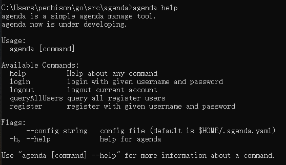
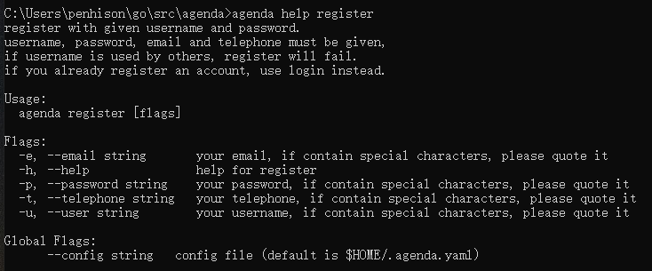
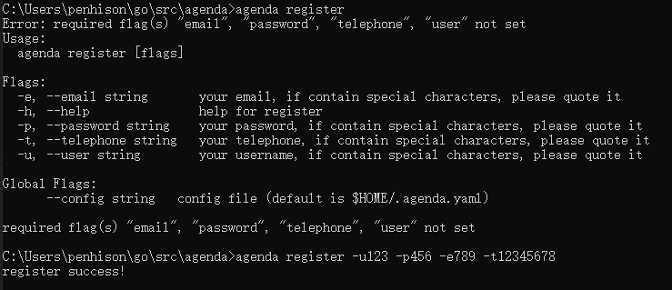
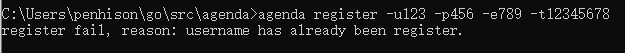
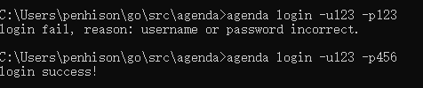
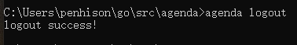
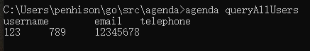
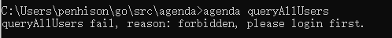

# agenda 议程管理系统
作业地址[https://pmlpml.github.io/ServiceComputingOnCloud/ex-cli-agenda](https://pmlpml.github.io/ServiceComputingOnCloud/ex-cli-agenda)，使用了cobra库,实现了用户的注册、登录、登出、查询所有用户四个命令。

## 设计说明
本来这个agenda应该是一个Client/Server模型的程序，这里将其本地化了，所有操作都在本地运行，所有数据也都在本地。

设计过程中遇上的坑：
1. json模块需要序列化的数据必须是可导出的，否则无法正常序列化。

##使用示例：
1. 帮助文档：
输入help获取总帮助，help后跟随子命令获取子命令的详细帮助

2. 注册
注册需提供所有信息，否则报错，没有已注册的重名用户则注册成功

2. 登录
注册需提供用户名和密码，无误则成功

3. 登出
如果已经登录，则登出，否则不执行操作

4. 查询所有用户
如果已经登录则返回所有用户，否则提示错误

